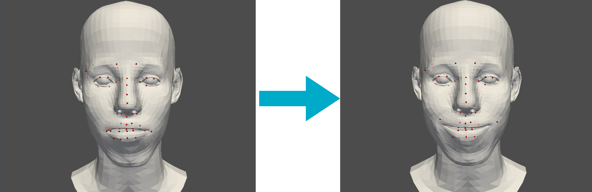

# 3DSSL-SS23_IntuitiveAnimation

## First attempt: Re-fitting landmarks with FLAME
<div align=center></div>

This approch fits FLAME model to 51 landmarks of human face. User can adjust landmarks in pyVista viewer via dragging and see a deformed face.

Performance is poor since it takes a lot of time to fit FLAME model to landmarks. Won't be an option for practical use.

### Requirements
The requirements are exactly the same with toy task except pyTorch.

### Running
Before running this demo, please follow the installation step and download models as suggested in toy task below.

Then make sure that you are in "refit" folder and run
```
python refit.py
```

## Interactive FLAME model viewer (Toy Task)

<div align=center></div>

Here's an interavtive FLAME model viewer created with PyVista. Several slider bars are added to allow user to adjust parameters of FLAME model. The code uses Python 3.8 and is tested on PyTorch 2.0.0+cu117.

### Installation
You can create a model folder in the root folder of this project and install all requirements of toyTask by running following commands from the terminal.
```
mkdir model
cd toyTask
pip install -r requirements.txt
```

### Download models
- Download FLAME model from <a href="http://flame.is.tue.mpg.de/" rel="nofollow">here</a>. Copy the downloaded model inside the model folder.
- Download Landmark embedings from <a href="https://github.com/soubhiksanyal/RingNet/tree/master/flame_model">RingNet Project</a>. Copy them inside the model folder.

### Running viewer
Make sure that you are in toyTask folder, then simply run the following command from the terminal.
```
python viewer.py
```
